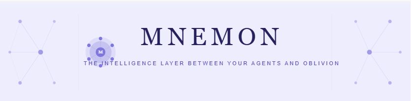

<div align="center">



# Mnemon

**Stop paying for work your agent already did. Watch it get better every run.**

[](https://pypi.org/project/mnemon-ai/)
[](https://pypi.org/project/mnemon-ai/)
[](LICENSE)
[](https://pypi.org/project/mnemon-ai/)

[Install](#install) · [Quickstart](#quickstart) · [Benchmarks](#the-numbers) · [API](#api)

</div>

---

Mnemon gives your agent two things:

**Token and latency savings** — repeated tasks skip the LLM entirely. 2.66ms instead of 20 seconds. Zero tokens instead of 1,250. The more your agent runs, the more it saves.

**A learning loop** — every outcome is observed, every pattern is detected, every failure is quarantined. Your agent doesn't just cache work — it accumulates intelligence that makes the next run cheaper and better than the last.

One line of code. No infrastructure. No changes to your existing agent.

```python
import mnemon
m = mnemon.init()
```

---

## The Problem

Every agent framework — LangChain, CrewAI, AutoGen, LangGraph — is **stateless by default**.

Your agent generates a security report for Acme Corp every Monday. Every Monday it starts from zero: re-reads the same context, re-reasons through the same structure, re-generates the same plan. You pay full LLM price each time. It never gets faster. It never gets smarter.

> **You built a smart agent. You got an amnesiac that invoices you twice.**

---

## Two Things That Fix This

### 1. Execution Memory Engine — save tokens and time

The EME is a generalised execution cache for any expensive recurring computation. After the first run, Mnemon fingerprints the plan and stores it. Every subsequent run with the same — or semantically similar — goal is served from cache.

```
First run:  20,000ms · 1,250 tokens · full cost
Every repeat:  2.66ms · 0 tokens   · $0.00
```

It works in two modes:

- **System 1** — exact fingerprint match. Sub-millisecond. Zero LLM calls.
- **System 2** — partial segment match. Only the changed parts go to the LLM. You pay for the delta, not the whole plan.

Failed segments are quarantined by the Retrospector — bad patterns can't recycle into future plans.

Ships with 49 pre-warmed segments from real enterprise runs so the cache starts warm on day one.

### 2. Experience Bus — a learning loop that never stops

The Bus is a passive observer. Every computation outcome — success, failure, latency, pattern — is recorded and analysed in the background. You never call it directly. It's always running.

What it detects:

| Signal | What it means |
|---|---|
| `DEGRADATION` | latency spike vs rolling baseline |
| `PATTERN_FOUND` | a task type is failing at >30% — before you notice |
| `ANOMALY` | sudden failure after a string of successes |
| `RECOVERY` | the agent is stable again after a failure streak |

What it does with that intelligence: feeds it back to the EME. Success patterns strengthen the fragment library. Failure patterns trigger quarantine. The cache gets smarter on every run — not just bigger.

This is the loop: **EME saves the work. Bus learns from it. Both get better.**

---

## The Numbers

### Execution cache — EME benchmarks

| | |
|---|---|
| System 1 hit (exact match) | **2.66ms** |
| Fresh LLM generation | ~20,000ms |
| Speedup | **7,500×** |
| 50 concurrent agents, burst | 0 LLM calls · 0.18s total |
| Tokens saved (50 agents) | 62,500 |
| Cost saved (50 agents) | $0.94 |

### At scale (80% System 1 + 15% System 2 hit rate)

| Daily plans | Monthly cost saved |
|---|---|
| 100 | $56 |
| 1,000 | $503 |
| 10,000 | $5,034 |
| 100,000 | **$50,344** |

### What your session looks like

```
Mnemon: ~1,250 tokens saved · ~$0.0038 · 20.0s faster
Mnemon: 3 plan(s) cached → next run saves ~3,750 tokens (~$0.0113)
```

Full runs, methodology, and raw data: [`reports/`](reports/)

---

## Zero Code Changes

Mnemon patches your installed frameworks at the call level. One import, nothing else:

```python
import mnemon
m = mnemon.init()

# everything below is unchanged
from langchain_anthropic import ChatAnthropic
llm = ChatAnthropic(model="claude-sonnet-4-6")
response = llm.invoke("Generate weekly security report for Acme Corp")
```

Supported frameworks:

| Framework | What gets patched |
|---|---|
| Anthropic SDK | `client.messages.create` |
| OpenAI SDK | `client.chat.completions.create` |
| LangChain | `BaseChatModel.invoke` / `ainvoke` |
| LangGraph | `CompiledGraph.invoke` / `ainvoke` |
| CrewAI | crew kickoff via event bus hook |
| AutoGen | `ConversableAgent.generate_reply` |

**Framework notes:**
- **LangGraph** — call `mnemon.init()` *before* compiling your graph.
- **CrewAI** — import `crewai` *before* calling `mnemon.init()`.

---

## vs. Everything Else

| | Mnemon | Mem0 | LangMem | Roll your own |
|---|:---:|:---:|:---:|:---:|
| Execution caching (skip LLM entirely) | ✅ | ❌ | ❌ | ❌ |
| System learning loop | ✅ | ❌ | ❌ | ❌ |
| Zero-code auto-instrumentation | ✅ | ❌ | ❌ | ❌ |
| Runs fully local (no cloud, no API) | ✅ | ❌ | ❌ | ✅ |
| Drift detection | ✅ | ❌ | ❌ | ❌ |
| Multi-tenant isolation | ✅ | ✅ | ❌ | ⚠️ |
| One-line setup | ✅ | ❌ | ❌ | ❌ |

Every other library makes your prompt slightly better. Mnemon eliminates the LLM call on repeated work and makes the next run cheaper than the last.

---

## Install

```bash
pip install mnemon-ai
```

```bash
pip install mnemon-ai[embeddings]   # sentence-transformers — recommended for production
pip install mnemon-ai[full]         # embeddings + all LLM providers
```

Set one environment variable (used only for gap-fill — retrieval never calls the LLM):

```bash
export GROQ_API_KEY=gsk_...      # pip install mnemon-ai[groq]   ← free tier, start here
export ANTHROPIC_API_KEY=sk-...  # pip install mnemon-ai[anthropic]
export OPENAI_API_KEY=sk-...     # pip install mnemon-ai[openai]
export GOOGLE_API_KEY=AIza...    # pip install mnemon-ai[google]
```

Mnemon detects the key automatically.

**No API key? Try the demo:**
```bash
mnemon demo
```

---

## Quickstart

```python
import mnemon

m = mnemon.init()
# Auto-detects your project name, creates a local SQLite DB,
# patches installed frameworks, starts the Bus.
# Access the same instance from anywhere:
m = mnemon.get()
```

### Run a cached plan

```python
result = m.run(
    goal="weekly security audit for Acme Corp",
    inputs={"client": "Acme Corp", "week": "Apr 21-25"},
    generation_fn=your_planning_function,
)

print(result["cache_level"])       # "system1" | "system2" | "miss"
print(result["tokens_saved"])      # 1250
print(result["latency_saved_ms"])  # 20000.0
print(result["segments_reused"])   # how many plan segments came from cache
```

`generation_fn` receives `(goal, inputs, context, capabilities, constraints)` and returns your plan. It's only called on a cache miss.

### See what you've saved

```python
print(m.waste_report)   # repeated queries and their cumulative cost
print(m.get_stats())    # EME stats, bus signals, security config
```

---

## API

### Init

```python
m = mnemon.init()                             # global singleton
m = mnemon.init(tenant_id="acme_corp")        # explicit tenant
m = mnemon.init(silent=True)                  # suppress session summary
m = mnemon.init(eme_enabled=False)            # bus + MOTH only
m = mnemon.init(bus_enabled=False)            # EME + MOTH only
m = mnemon.get()                              # retrieve the running instance
```

### Diagnostics

```python
report = m.drift_report()   # cross-session degradation analysis
stats  = m.get_stats()      # EME, bus, watchdog, DB stats
print(m.waste_report)       # repeated queries + cost
```

CLI:
```bash
mnemon doctor   # health check
mnemon demo     # live demo
```

### Async

```python
from mnemon import Mnemon

async with Mnemon(tenant_id="my_company") as m:
    result = await m.run(
        goal="weekly security audit for Acme Corp",
        inputs={"client": "Acme Corp", "week": "Apr 21-25"},
        generation_fn=my_planning_function,
    )
    print(result["cache_level"])
    print(result["tokens_saved"])
```

### Production — multi-tenant

```python
from mnemon import Mnemon
from mnemon.security.manager import TenantSecurityConfig

m = Mnemon(
    tenant_id="acme_corp",
    security_config=TenantSecurityConfig(
        tenant_id="acme_corp",
        blocked_categories=["pii", "medical_records"],
        encrypt_privileged=True,
    ),
    enable_watchdog=True,
    enable_telemetry=True,
)
```

Each `tenant_id` gets an isolated SQLite database — no cross-tenant leakage.

### From config

```python
m = Mnemon.from_config("./mnemon.config.json")
```

---

## Fail-Safe

Mnemon never crashes the system it wraps.

| What fails | What happens |
|---|---|
| EME cache | `generation_fn` called directly |
| Experience bus | agent continues unmonitored |
| Database unavailable | in-memory fallback |

All failures are logged, never raised. You can't break your agent by adding Mnemon.

---

## Why This Exists

These aren't hypothetical — we filed these issues before writing a line of Mnemon:

- [CrewAI #4415](https://github.com/crewAIInc/crewAI/issues/4415) — context pollution and DB write contention in multi-agent runs
- [Dify #32306](https://github.com/langgenius/dify/issues/32306) — redundant reasoning tax in agent nodes
- [Kimi CLI #1058](https://github.com/MoonshotAI/kimi-cli/issues/1058) — context saturation in 100-agent swarms
- [E2B #1207](https://github.com/e2b-dev/E2B/issues/1207) — environmental amnesia across sandbox restarts

---

## License

MIT. Free to use, free to build on.

---

<div align="center">
<sub>Mnemon was Alexander the Great's personal historian — the one whose only job was to ensure nothing was ever forgotten, so every campaign built on the total accumulated knowledge of every campaign before it.<br>Your agents have a Mnemon now.</sub>
</div>
