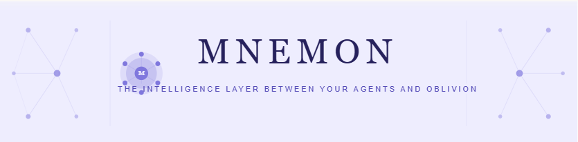

<div align="center">



# Mnemon

**Stop paying for work your agent already did.**

[](https://pypi.org/project/mnemon-ai/)
[](https://pypi.org/project/mnemon-ai/)
[](LICENSE)
[](https://pypi.org/project/mnemon-ai/)

</div>

---

Your agent runs the same task every week. It pays full LLM price every time. It never remembers. It never gets faster.

Mnemon fixes that. It caches what your agent has already figured out, learns from every run, and makes each subsequent run cheaper and faster than the last.

```bash
pip install mnemon-ai
mnemon demo     # see it working in 30 seconds
```

---

## What Mnemon does

Mnemon has three components. They work together automatically.

### 1. Execution Memory Engine (EME) — the cache

The EME stores what your agent has done before. On repeat runs it skips the LLM entirely.

```
First run:    20,000ms · 1,250 tokens · full cost
Every repeat:  2.66ms  · 0 tokens    · $0.00
```

Two matching modes:

- **System 1** — exact match. Sub-millisecond. Zero tokens. No LLM call.
- **System 2** — semantic match. "Weekly security report" hits the cache for "generate security audit". Only the parts that actually changed go to the LLM.

### 2. Experience Bus — the learning loop

The Bus watches every run in the background. You never call it directly — it's always on.

It detects patterns, flags failures, quarantines bad plans, and strengthens what works. The cache gets smarter every run, not just bigger.

You get this for free. Nothing to configure.

### 3. MOTH — the auto-instrumentation layer

MOTH patches your existing frameworks at startup. It's how Mnemon sees what your agent is doing without you changing any code.

Supported: **Anthropic SDK · OpenAI SDK · LangChain · LangGraph · CrewAI · AutoGen**

---

## Which path should I use?

There are two ways to use Mnemon. Pick one based on what you're building.

---

### Path 1 — Response caching (zero code changes)

**Use this if:** you call an LLM directly and want to cache the responses. Works for chatbots, simple agents, any direct SDK usage.

```python
import mnemon
mnemon.init()   # patches your installed frameworks automatically

# your existing code — completely unchanged
from anthropic import Anthropic
client = Anthropic()
response = client.messages.create(
    model="claude-sonnet-4-6",
    max_tokens=1024,
    messages=[{"role": "user", "content": "Generate weekly security report for Acme Corp"}]
)
```

First call: normal. Every call after with the same or similar input: instant, zero tokens.

**What you get:** System 1 + System 2 response caching. The Bus learning loop. All automatic.

---

### Path 2 — Execution plan caching with `m.run()` (full system)

**Use this if:** your agent runs structured recurring tasks — research workflows, recurring reports, multi-step pipelines. This gives you the full EME with segment-level caching, gap fill, and guided generation.

```python
import mnemon
from anthropic import Anthropic

client = Anthropic()
m = mnemon.init()

def generate_report(goal, inputs, context, capabilities, constraints):
    # only called on a cache miss — put your real LLM logic here
    response = client.messages.create(
        model="claude-sonnet-4-6",
        max_tokens=1024,
        messages=[{"role": "user", "content": goal}],
    )
    return response.content[0].text

result = m.run(
    goal="weekly security audit for Acme Corp",
    inputs={"client": "Acme Corp", "week": "Apr 21-25"},
    generation_fn=generate_report,
)

print(result["output"])            # your result
print(result["cache_level"])       # "system1" | "system2" | "miss"
print(result["tokens_saved"])      # tokens saved on this run
print(result["latency_saved_ms"])  # ms saved on this run
```

**What you get:** full EME — exact + semantic caching at the segment level, gap fill for partially changed plans, guided generation so your LLM only generates what's new, Bus learning loop, Retrospector quarantine.

---

## Install

```bash
pip install mnemon-ai
```

**System 2 semantic matching** — enable one of:

```bash
pip install mnemon-ai[full]    # offline, no API key (recommended)
export OPENAI_API_KEY=sk-...   # or set this — auto-detected
```

Without either, Mnemon runs System 1 only (exact match). Still valuable, just no semantic matching.

**Optional — share anonymous usage stats:**
```bash
export MNEMON_TELEMETRY=1
```

---

## The numbers

| | |
|---|---|
| System 1 hit latency | **2.66ms** |
| Typical LLM call | ~20,000ms |
| Speedup on cache hit | **7,500×** |
| Token reduction | **93%** |

At scale (80% hit rate):

| Daily runs | Monthly savings |
|---|---|
| 100 | $56 |
| 1,000 | $503 |
| 10,000 | $5,034 |

> Stanford researchers published [*Agentic Plan Caching*](https://arxiv.org/abs/2506.14852) at NeurIPS 2025, measuring 50.31% cost reduction with the same approach. Mnemon is the production implementation — one import, works today.

---

## What prints on each run

**First run:**
```
Mnemon: first run — plan cached, next run will be instant
```

**Cache hit:**
```
Mnemon: cache hit · 1,250 tokens saved · ~$0.0038 · 20.0s faster
```

**New input (cached for next time):**
```
Mnemon: new input — cached, next run will be instant
```

---

## Diagnostics

```bash
mnemon doctor   # health check — DB, embedder, fragment library
mnemon demo     # live demo — no API key needed
```

```python
m = mnemon.get()         # retrieve running instance from anywhere
print(m.get_stats())     # EME, bus, DB stats
print(m.waste_report)    # repeated queries and their cost
```

---

## Configuration

```python
m = mnemon.init(tenant_id="acme_corp")   # isolate by tenant
m = mnemon.init(silent=True)             # suppress output
m = mnemon.init(eme_enabled=False)       # bus + MOTH only
m = mnemon.init(bus_enabled=False)       # EME + MOTH only
```

Multi-tenant — each `tenant_id` gets an isolated SQLite database:

```python
from mnemon import Mnemon
async with Mnemon(tenant_id="acme_corp") as m:
    result = await m.run(goal="...", inputs={...}, generation_fn=fn)
```

---

## Fail-safe

Mnemon never crashes the system it wraps.

| What fails | What happens |
|---|---|
| EME cache | `generation_fn` called directly — no disruption |
| Experience Bus | agent continues unmonitored |
| Database | in-memory fallback |

---

## vs. everything else

| | Mnemon | Mem0 | LangMem | Roll your own |
|---|:---:|:---:|:---:|:---:|
| Execution caching (skip LLM entirely) | ✅ | ❌ | ❌ | ❌ |
| System learning loop | ✅ | ❌ | ❌ | ❌ |
| Zero-code auto-instrumentation | ✅ | ❌ | ❌ | ❌ |
| Fully local (no cloud, no API) | ✅ | ❌ | ❌ | ✅ |
| One-line setup | ✅ | ❌ | ❌ | ❌ |

---

## License

MIT. Free to use, free to build on.

Questions or integration help: mahikajadhav22@gmail.com

---

<div align="center">
<sub>Mnemon was Alexander the Great's personal historian — the one whose only job was to ensure nothing was ever forgotten, so every campaign built on the total accumulated knowledge of every campaign before it.<br>Your agents have a Mnemon now.</sub>
</div>
