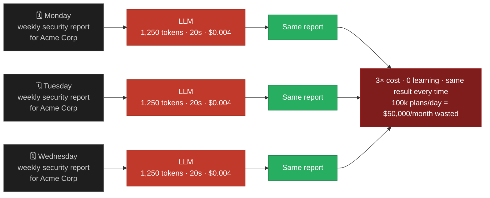
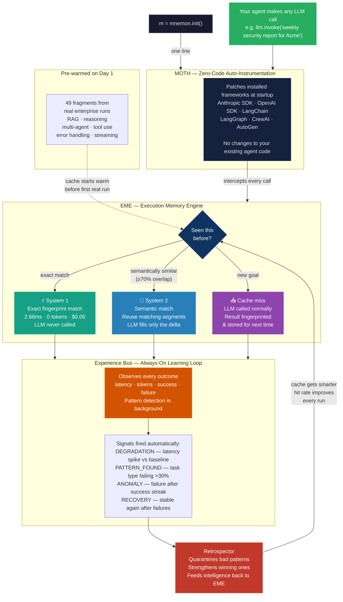

# Mnemon — How It Works

## The Problem

Every agent framework is **stateless by default**. Your agent runs the same task Monday, Tuesday, Wednesday — and pays the LLM full price every single time.



> **You built a smart agent. You got an amnesiac that invoices you twice.**

---

## The Fix — One Line

```python
import mnemon
m = mnemon.init()      # ← this is the entire integration
```

---

## How Mnemon Works



---

## The Numbers

| | First run | Every repeat |
|---|---|---|
| Latency | ~20,000ms | **2.66ms** |
| Tokens | 1,250 | **0** |
| Cost | $0.004 | **$0.00** |
| Speedup | — | **7,500×** |

### At scale (80% System 1 + 15% System 2 hit rate)

| Daily plans | Monthly cost saved |
|---|---|
| 100 | $56 |
| 1,000 | $503 |
| 10,000 | $5,034 |
| 100,000 | **$50,344** |

---

## What Makes This Different

| | Mnemon | Mem0 | LangMem | Roll your own |
|---|:---:|:---:|:---:|:---:|
| Skip LLM entirely on repeated work | ✅ | ❌ | ❌ | ❌ |
| System learning loop | ✅ | ❌ | ❌ | ❌ |
| Zero-code auto-instrumentation | ✅ | ❌ | ❌ | ❌ |
| Fully local — no cloud, no API | ✅ | ❌ | ❌ | ✅ |
| Drift detection | ✅ | ❌ | ❌ | ❌ |
| One-line setup | ✅ | ❌ | ❌ | ❌ |

Every other library makes your prompt slightly better.  
**Mnemon eliminates the LLM call on repeated work and makes the next run cheaper than the last.**
